# GAME ARKANOID

## 🧩 1. Giới thiệu

**Arkanoid** là trò chơi “đập gạch” cổ điển được phát triển bằng **Java Swing** với phong cách hiện đại.  
Người chơi điều khiển thanh đỡ (Paddle) để bật bóng phá hủy các khối gạch trên màn hình, thu thập các **Power-up** (vật phẩm tăng sức mạnh) và vượt qua các **màn chơi (Map)** có độ khó tăng dần.

Dự án được phát triển theo **Lập trình Hướng đối tượng (OOP)**, áp dụng đầy đủ bốn nguyên lý:  
- Đóng gói (Encapsulation)  
- Kế thừa (Inheritance)  
- Đa hình (Polymorphism)  
- Trừu tượng hóa (Abstraction)

---

## 🎯 2. Video demo

---

## 🧱 3. Tổ chức mã nguồn (tóm tắt + sơ đồ lớp)

Phần này tóm tắt cấu trúc dự án và cung cấp một sơ đồ lớp tổng quát (chỉ các lớp đặc trưng) để dễ hình dung mối quan hệ chính giữa các thành phần.

### Cấu trúc chính (tóm tắt)
- `src/Constant` — hằng số và tài nguyên (kích thước, ảnh, âm thanh paths).
- `src/entity` — các đối tượng trong game (tất cả kế thừa `Entity`).
- `src/game` — engine/scene/GUI: `GameEngine`, `GamePanel`, `Scene` và các `scenes/*` (Menu/GameScene/Pause/GameOver/Win).
- `src/manager` — singleton quản lý: `BlockManager`, `PowerUpManager`, `MapManager`, `SoundManager`.

### Sơ đồ lớp (chỉ các lớp tổng quát, mermaid)

```mermaid
classDiagram
direction BT
class Ball {
  - Ball(int, int, int, int) 
  - boolean isFire
  - double speed
  - int velocityX
  - int velocityY
  - int RADIUS
  - Ball instance
  - collisionWithSideWall() boolean
  - collisionWithUpperWall() boolean
  + getCollisionSide(Entity) String
  + runBall() void
  + render(Graphics) void
  + update() void
  + reset() void
  - collisionWithPaddle() String
  + respawn() void
  - checkBlockCollision() void
   Ball instance
   boolean isFire
   double speed
   boolean isAlive
   int RADIUS
   boolean isRunning
   int velocityY
   int velocityX
}
class Block {
  + Block(int, int, int, int, int) 
  + Block(int, int, int) 
  + Block(int, int) 
  - int HP
  - int MAX_HP
  - boolean isAlive
  + decreaseHP(int) void
  + die() void
  + render(Graphics) void
   boolean isAlive
   int MAX_HP
   int HP
}
class BlockBedrock {
  + BlockBedrock(int, int, int, int) 
  + BlockBedrock(int, int) 
  + decreaseHP(int) void
}
class BlockBomb {
  + BlockBomb(int, int) 
  + BlockBomb(int, int, int, int, int, int) 
  + BlockBomb(int, int, int, int) 
  + BlockBomb(int, int, int, int, int, int, int) 
  - int damage
  - int radius
  + die() void
  - clamp(double, double, double) double
  + checkBombEffect(Block) boolean
  + exploded() void
  + render(Graphics) void
   int damage
   int radius
}
class BlockLucky {
  + BlockLucky(int, int, int, int, int) 
  + BlockLucky(int, int, int, int, int, int) 
  + BlockLucky(int, int, int, int) 
  + BlockLucky(int, int) 
  + die() void
}
class BlockManager {
  - BlockManager() 
  - BlockManager instance
  - ArrayList~Block~ blocks
  + String currentMap
  + reset() void
  + load(String) void
  + addBlock(Block) void
  + removeBlock(Block) void
  + render(Graphics) void
  + load(InputStream) void
  + checkWin() boolean
  + test() void
   BlockManager instance
   ArrayList~Block~ blocks
   String currentMap
}
class Constant {
  + Constant() 
  + createBtn(String) JButton
}
class Entity {
  + Entity(int, int, int, int) 
  # int y
  # int x
  # int width
  # int height
  + getCollisionSide(int, int, int, int) String
  + getCollisionSide(Entity) String
  + isCollision(Entity) boolean
   int y
   int x
   int height
   int width
}
class GameEngine {
  + GameEngine() 
  + run() void
  + stop() void
}
class GameOver {
  - GameOver() 
  - JButton playAgainButton
  - GameOver instance
  - JButton menuButton
  + addButtonsToPanel(JPanel) void
  + render(Graphics) void
   GameOver instance
   JButton playAgainButton
   JButton menuButton
}
class GamePanel {
  - GamePanel() 
  - GamePanel instance
  - Scene currentScene
  # paintComponent(Graphics) void
  + resetInstance() void
   Scene currentScene
   Scene scene
   GamePanel instance
}
class GameScene {
  - GameScene() 
  + GameScene instance
  + useMouse() boolean
  + useKeyboard() boolean
  + stopGame() void
  + continueGame() GameScene
  + paintComponent(Graphics) void
  + update() void
  + resetScene() GameScene
  + setupKeyBindings() void
  + startGame() void
  - removeAllButtons() void
   boolean gameStarted
   GameScene instance
   MouseListener mouseListener
   MouseMotionListener mouseMotionListener
}
class Map {
  + Map(int, String, String, boolean, JButton) 
  + unlock() void
}
class MapManager {
  + MapManager() 
  - int currentMap
  - MapManager instance
  - int page
  + load() void
  + save() void
  + hasNextMap() boolean
  + unlockNextMap() void
   MapManager instance
   Map lastUnlockedMap
   int page
   ArrayList~Map~ mapsByPage
   Map currentMap
   int totalPages
}
class MapScene {
  + MapScene() 
  + paintComponent(Graphics) void
  + useKeyboard() boolean
  + changePage(int) void
  + setupKeyBindings() void
}
class MenuScene {
  + MenuScene() 
  + setupKeyBindings() void
  + paintComponent(Graphics) void
  + useMouse() boolean
  + useKeyboard() boolean
}
class Paddle {
  - Paddle(int, int, int, int) 
  + double speed
  - boolean working
  - Paddle instance
  - boolean movingRight
  - boolean movingLeft
  + update() void
  + reset() void
  + render(Graphics) void
   Paddle instance
   boolean working
   double speed
   boolean movingLeft
   boolean movingRight
}
class Pause {
  - Pause() 
  - JButton playAgainButton
  - Pause instance
  - JButton menuButton
  - JButton resumeButton
  + addButtonsToPanel(JPanel) void
  + render(Graphics) void
   Pause instance
   JButton playAgainButton
   JButton resumeButton
   JButton menuButton
}
class PowerUp {
  + PowerUp(int, int, int, int, String) 
  # boolean isActive
  + update() void
  + activate() void
  + render(Graphics) void
  + deactivate() void
   boolean isActive
   boolean expired
}
class PowerUpBallExpand {
  + PowerUpBallExpand(int, int) 
  + deactivate() void
  + activate() void
}
class PowerUpBallExtraLife {
  + PowerUpBallExtraLife(int, int) 
  + deactivate() void
  + activate() void
}
class PowerUpBallFast {
  + PowerUpBallFast(int, int) 
  + deactivate() void
  + activate() void
}
class PowerUpBallFire {
  + PowerUpBallFire(int, int) 
  + deactivate() void
  + activate() void
}
class PowerUpBallShrink {
  + PowerUpBallShrink(int, int) 
  + deactivate() void
  + activate() void
}
class PowerUpBallSlow {
  + PowerUpBallSlow(int, int) 
  + deactivate() void
  + activate() void
}
class PowerUpCatchBall {
  + PowerUpCatchBall(int, int) 
  + deactivate() void
  + activate() void
}
class PowerUpManager {
  + PowerUpManager() 
  - PowerUpManager instance
  + update() void
  + render(Graphics) void
  + reset() void
  + addPowerUp(PowerUp) void
  + removePowerUp(PowerUp) void
   ArrayList~PowerUp~ powerUps
   PowerUpManager instance
}
class PowerUpPaddleExpand {
  + PowerUpPaddleExpand(int, int) 
  + activate() void
  + deactivate() void
}
class PowerUpPaddleFast {
  + PowerUpPaddleFast(int, int) 
  + activate() void
  + deactivate() void
}
class PowerUpPaddleShrink {
  + PowerUpPaddleShrink(int, int) 
  + activate() void
  + deactivate() void
}
class PowerUpPaddleSlow {
  + PowerUpPaddleSlow(int, int) 
  + activate() void
  + deactivate() void
}
class PowerUpRandom {
  + PowerUpRandom(int, int) 
  + activate() void
  + deactivate() void
  + toString() String
}
class Scene {
  + Scene() 
  + Scene(Image) 
  + useMouse() boolean
  + useKeyboard() boolean
  + update() void
  # paintComponent(Graphics) void
  + setupKeyBindings() void
   KeyListener keyListener
   MouseListener mouseListener
   MouseMotionListener mouseMotionListener
}
class SoundManager {
  + SoundManager() 
  + play(String) void
  + stop(String) void
  + init() void
  + loadSound(String, String) void
  + loop(String) void
}
class Tester {
  + Tester() 
  + testBallReset() void
  + testPaddleReset() void
  + testBallSetSpeed() void
  + testPaddleWorkingState() void
  + testBallSingleton() void
  + testBallHealthRespawn() void
  + testBallSetFire() void
  + testCollisionSideTop() void
  + testEntityCollisionFalse() void
  + testEntityCollisionTrue() void
  + testPaddleSingleton() void
  + testPaddleSetSpeed() void
}
class Win {
  - Win() 
  - Win instance
  - JButton playAgainButton
  - JButton nextLevelButton
  - JButton menuButton
  + addButtonsToPanel(JPanel) void
  + render(Graphics) void
  + renderButtons(Graphics) void
   JButton playAgainButton
   JButton menuButton
   Win instance
   JButton nextLevelButton
}
class main {
  + main() 
  + main(String[]) void
}

Ball  -->  Entity 
Block  -->  Entity 
BlockBedrock  -->  Block 
BlockBomb  -->  Block 
BlockLucky  -->  Block 
GameScene  -->  Scene 
MapManager  -->  Map 
MapScene  -->  Scene 
MenuScene  -->  Scene 
Paddle  -->  Entity 
PowerUp  -->  Entity 
PowerUpBallExpand  -->  PowerUp 
PowerUpBallExtraLife  -->  PowerUp 
PowerUpBallFast  -->  PowerUp 
PowerUpBallFire  -->  PowerUp 
PowerUpBallShrink  -->  PowerUp 
PowerUpBallSlow  -->  PowerUp 
PowerUpCatchBall  -->  PowerUp 
PowerUpPaddleExpand  -->  PowerUp 
PowerUpPaddleFast  -->  PowerUp 
PowerUpPaddleShrink  -->  PowerUp 
PowerUpPaddleSlow  -->  PowerUp 
PowerUpRandom  -->  PowerUp 

```

Ghi chú: sơ đồ trên nhằm minh họa luồng dữ liệu và phụ thuộc chính — không liệt kê mọi lớp nhỏ (ví dụ các loại `Block`/`PowerUp` cụ thể được coi là các triển khai con của `Block`/`PowerUp`).

---

## 🧩 4. Các Interface và nguyên lý OOP áp dụng

| Nguyên lý | Ứng dụng trong dự án |
|------------|----------------------|
| **Encapsulation (Đóng gói)** | Các thuộc tính như `x`, `y`, `velocityX`, `velocityY` được khai báo `private`, truy cập qua getter/setter. |
| **Inheritance (Kế thừa)** | `BlockBedrock`, `BlockBomb`, `BlockLucky` kế thừa từ `Block`. Tương tự các lớp PowerUp kế thừa từ `PowerUp` cha. |
| **Polymorphism (Đa hình)** | Phương thức `activate()` và `deactivate()` được ghi đè ở từng loại PowerUp với hiệu ứng riêng. |
| **Abstraction (Trừu tượng hóa)** | `Entity` và `Scene` là lớp trừu tượng định nghĩa hành vi chung (`update()`, `render()`). |
| **Design Pattern** | Sử dụng **Singleton Pattern** trong các lớp `MapManager`, `BlockManager`, `SoundManager`. |

---

## ⚙️ 5. Kiến trúc OverlayScene (tập trung)

Phần này mô tả ngắn gọn kiến trúc OverlayScene — cơ chế dùng để hiển thị các lớp phủ UI như Pause, GameOver, Win mà không làm xáo trộn logic game core.

Ý tưởng chính:
- `GamePanel` làm container chính và chứa `Scene` hiện tại (thường là `GameScene`).
- `GameScene` vẽ game world (entities, blocks, power-ups). Khi game không ở trạng thái chơi (paused/gameover/win), `GameScene` vẽ một lớp phủ (translucent overlay) và gọi `render()` của overlay tương ứng.
- Mỗi overlay (Pause, GameOver, Win) là một module chịu trách nhiệm cho UI của trạng thái đó: tạo `JButton`, xử lý `ActionListener`, và cung cấp hai phương thức chính:
	- `addButtonsToPanel(JPanel panel)` — thêm các nút vào panel khi overlay cần hiển thị (có kiểm tra `button.getParent() != panel` để tránh thêm trùng).
	- `render(Graphics g)` — vẽ bất kỳ nội dung overlay không phải là JButton (ví dụ tiêu đề, hướng dẫn) và gọi `button.setBounds(...)` để định vị nút.

Thiết kế này có các ưu điểm:
- Tách biệt: logic game (vật lý, cập nhật) không bị lẫn với UI overlay.
- Đơn giản để mở rộng: thêm overlay mới chỉ cần tuân theo contract trên.

Lifecycle / flow ngắn:
1. GameScene phát hiện trạng thái thay đổi (ví dụ ball chết → GAMEOVER).
2. GameScene gọi `GameOver.getInstance().addButtonsToPanel(this)`.
3. Trong `paintComponent`, GameScene vẽ lớp phủ mờ rồi gọi `GameOver.render(g)` để đặt bounds cho các nút.
4. Khi chuyển scene hoặc reset, GameScene loại bỏ các nút overlay khỏi panel (ví dụ thông qua một hàm `RemoveAllButton()`).

Ghi chú kỹ thuật ngắn:
- Để `button.setBounds(...)` có hiệu lực, `GameScene` dùng layout null (`setLayout(null)`) và `setPreferredSize(...)` cho kích thước cố định.
- Overlay thường được triển khai theo pattern singleton trong repo để giữ một bộ nút duy nhất và tránh tạo/xóa nhiều lần.

Phần này chỉ tập trung vào kiến trúc OverlayScene; các chi tiết như cách reset entity hoặc xử lý key bindings được mô tả ở các phần khác của README hoặc trong mã nguồn.

---

## 👥 6. Danh sách nhóm

| Họ và Tên         | Nhiệm vụ                                                                 |
|-------------------|---------------------------------------------------------------------------|
| **Đỗ Minh Hiếu**  | - BlockManager, MapManager, PowerUpManager, SoundManager - Menu, Map, Pause - JUnit tester |
| **Nguyễn Quốc Huy** | - Multi-threading - Code base - GameScene, GameOver, Win |
| **Nguyễn Mạnh Đức** | - Paddle - PowerUp - Block |
| **Lương Minh Dương** | - Ball - Physics |

---

## 🧠 7. Công nghệ sử dụng

* **Ngôn ngữ:** Java 17
* **Giao diện:** Java Swing
* **Đa luồng:** Thread + Timer
* **IDE:** IntelliJ IDEA / VsCode
* **Quản lý mã nguồn:** GitHub
* **Âm thanh:** WAV / MP3 (SoundManager)

---

## ⚡ 8. Power-Ups (tổng hợp)

Dưới đây là bảng liệt kê tất cả Power-Up xuất hiện trong game, kèm hình minh họa (đường dẫn tương đối trong repo) và mô tả ngắn về hiệu ứng của từng Power-Up.

| Tên Power-Up | Hình ảnh | Mô tả |
|---|---:|---|
| BallExpand |  | Tăng kích thước quả bóng, giúp dễ chạm vào gạch hơn. |
| BallExtraLife |  | Cấp thêm 1 mạng/đời cho người chơi. |
| BallFast |  | Tăng vận tốc quả bóng trong một thời gian ngắn. |
| BallFire |  | Bóng có thể xuyên qua một số loại gạch (fireball). |
| BallShrink |  | Giảm kích thước quả bóng (khó điều khiển hơn). |
| BallSlow |  | Giảm tốc độ quả bóng tạm thời, dễ điều khiển hơn. |
| CatchBall |  | Bật chế độ bắt bóng: khi bóng chạm paddle, nó dừng lại và chờ người chơi bắn tiếp. |
| PaddleExpand |  | Mở rộng kích thước paddle, giúp phòng thủ tốt hơn. |
| PaddleFast |  | Tăng tốc độ di chuyển paddle tạm thời. |
| PaddleShrink |  | Thu nhỏ paddle, làm trò chơi khó hơn. |
| PaddleSlow |  | Giảm tốc độ paddle tạm thời. |
| Random |  | Gây ra một hiệu ứng ngẫu nhiên trong số các power-up khả dụng. |

Ghi chú:
- Hình ảnh trong bảng tham chiếu file trong repo: `assets/images/PowerUp/` — bạn có thể thay đổi kích thước hiển thị bằng thuộc tính `width` trong thẻ `` nếu cần.
- Mô tả ở trên là tóm tắt; các chi tiết (thời lượng hiệu ứng, stack behavior, xác suất rơi) có thể được tìm thấy trong lớp tương ứng trong `src/entity/powerUp/`.

