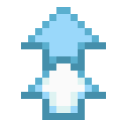
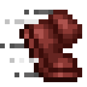

# GAME ARKANOID

## 🧩 1. Giới thiệu

**Arkanoid** là trò chơi “đập gạch” cổ điển được phát triển bằng **Java Swing** với phong cách hiện đại.  
Người chơi điều khiển thanh đỡ (Paddle) để bật bóng phá hủy các khối gạch trên màn hình, thu thập các **Power-up** (vật phẩm tăng sức mạnh) và vượt qua các **màn chơi (Map)** có độ khó tăng dần.

Dự án được phát triển theo **Lập trình Hướng đối tượng (OOP)**, áp dụng đầy đủ bốn nguyên lý:  
- Đóng gói (Encapsulation)  
- Kế thừa (Inheritance)  
- Đa hình (Polymorphism)  
- Trừu tượng hóa (Abstraction)

---

## 🎯 2. Video demo

---

## 🧱 3. Tổ chức mã nguồn (tóm tắt + sơ đồ lớp)

Phần này tóm tắt cấu trúc dự án và cung cấp một sơ đồ lớp tổng quát (chỉ các lớp đặc trưng) để dễ hình dung mối quan hệ chính giữa các thành phần.

### Cấu trúc chính (tóm tắt)
- `src/Constant` — hằng số và tài nguyên (kích thước, ảnh, âm thanh paths).
- `src/entity` — các đối tượng trong game (tất cả kế thừa `Entity`).
- `src/game` — engine/scene/GUI: `GameEngine`, `GamePanel`, `Scene` và các `scenes/*` (Menu/GameScene/Pause/GameOver/Win).
- `src/manager` — singleton quản lý: `BlockManager`, `PowerUpManager`, `MapManager`, `SoundManager`.

### Sơ đồ lớp (chỉ các lớp tổng quát, mermaid)

Ghi chú: sơ đồ trên nhằm minh họa luồng dữ liệu và phụ thuộc chính — không liệt kê mọi lớp nhỏ (ví dụ các loại `Block`/`PowerUp` cụ thể được coi là các triển khai con của `Block`/`PowerUp`).

---

## 🧩 4. Các Interface và nguyên lý OOP áp dụng

| Nguyên lý | Ứng dụng trong dự án |
|------------|----------------------|
| **Encapsulation (Đóng gói)** | Các thuộc tính như `x`, `y`, `velocityX`, `velocityY` được khai báo `private`, truy cập qua getter/setter. |
| **Inheritance (Kế thừa)** | `BlockBedrock`, `BlockBomb`, `BlockLucky` kế thừa từ `Block`. Tương tự các lớp PowerUp kế thừa từ `PowerUp` cha. |
| **Polymorphism (Đa hình)** | Phương thức `activate()` và `deactivate()` được ghi đè ở từng loại PowerUp với hiệu ứng riêng. |
| **Abstraction (Trừu tượng hóa)** | `Entity` và `Scene` là lớp trừu tượng định nghĩa hành vi chung (`update()`, `render()`). |
| **Design Pattern** | Sử dụng **Singleton Pattern** trong các lớp `MapManager`, `BlockManager`, `SoundManager`. |

---

## ⚙️ 5. Kiến trúc OverlayScene (tập trung)

Phần này mô tả ngắn gọn kiến trúc OverlayScene — cơ chế dùng để hiển thị các lớp phủ UI như Pause, GameOver, Win mà không làm xáo trộn logic game core.

Ý tưởng chính:
- `GamePanel` làm container chính và chứa `Scene` hiện tại (thường là `GameScene`).
- `GameScene` vẽ game world (entities, blocks, power-ups). Khi game không ở trạng thái chơi (paused/gameover/win), `GameScene` vẽ một lớp phủ (translucent overlay) và gọi `render()` của overlay tương ứng.
- Mỗi overlay (Pause, GameOver, Win) là một module chịu trách nhiệm cho UI của trạng thái đó: tạo `JButton`, xử lý `ActionListener`, và cung cấp hai phương thức chính:
	- `addButtonsToPanel(JPanel panel)` — thêm các nút vào panel khi overlay cần hiển thị (có kiểm tra `button.getParent() != panel` để tránh thêm trùng).
	- `render(Graphics g)` — vẽ bất kỳ nội dung overlay không phải là JButton (ví dụ tiêu đề, hướng dẫn) và gọi `button.setBounds(...)` để định vị nút.

Thiết kế này có các ưu điểm:
- Tách biệt: logic game (vật lý, cập nhật) không bị lẫn với UI overlay.
- Đơn giản để mở rộng: thêm overlay mới chỉ cần tuân theo contract trên.

Lifecycle / flow ngắn:
1. GameScene phát hiện trạng thái thay đổi (ví dụ ball chết → GAMEOVER).
2. GameScene gọi `GameOver.getInstance().addButtonsToPanel(this)`.
3. Trong `paintComponent`, GameScene vẽ lớp phủ mờ rồi gọi `GameOver.render(g)` để đặt bounds cho các nút.
4. Khi chuyển scene hoặc reset, GameScene loại bỏ các nút overlay khỏi panel (ví dụ thông qua một hàm `RemoveAllButton()`).

Ghi chú kỹ thuật ngắn:
- Để `button.setBounds(...)` có hiệu lực, `GameScene` dùng layout null (`setLayout(null)`) và `setPreferredSize(...)` cho kích thước cố định.
- Overlay thường được triển khai theo pattern singleton trong repo để giữ một bộ nút duy nhất và tránh tạo/xóa nhiều lần.

Phần này chỉ tập trung vào kiến trúc OverlayScene; các chi tiết như cách reset entity hoặc xử lý key bindings được mô tả ở các phần khác của README hoặc trong mã nguồn.

---

## 👥 6. Danh sách nhóm

| Họ và Tên         | Nhiệm vụ                                                                 |
|-------------------|---------------------------------------------------------------------------|
| **Đỗ Minh Hiếu**  | - BlockManager, MapManager, PowerUpManager, SoundManager - Menu, Map, Pause - JUnit tester |
| **Nguyễn Quốc Huy** | - Multi-threading - Code base - GameScene, GameOver, Win |
| **Nguyễn Mạnh Đức** | - Paddle - PowerUp - Block |
| **Lương Minh Dương** | - Ball - Physics |

---

## 🧠 7. Công nghệ sử dụng

* **Ngôn ngữ:** Java 17
* **Giao diện:** Java Swing
* **Đa luồng:** Thread + Timer
* **IDE:** IntelliJ IDEA / VsCode
* **Quản lý mã nguồn:** GitHub
* **Âm thanh:** WAV / MP3 (SoundManager)

---

## ⚡ 8. Power-Ups (tổng hợp)

| Tên Power-Up | Hình ảnh | Mô tả |
|---|---:|---|
| BallExpand |  | Tăng kích thước quả bóng, giúp dễ chạm vào gạch hơn. |
| BallExtraLife |  | Cấp thêm 1 mạng/Ä‘á»i cho người chơi. |
| BallFast |  | Tăng vận tốc quả bóng trong một thá»i gian ngắn. |
| BallFire |  | Bóng có thể xuyên qua một số loại gạch (fireball). |
| BallShrink |  | Giảm kích thước quả bóng (khó điá»u khiển hơn). |
| BallSlow |  | Giảm tốc độ quả bóng tạm thá»i, dễ điá»u khiển hơn. |
| CatchBall |  | Bật chế độ bắt bóng: khi bóng chạm paddle, nó dừng lại và chá» người chơi bắn tiếp. |
| PaddleExpand |  | Mở rộng kích thước paddle, giúp phòng thủ tốt hơn. |
| PaddleFast |  | Tăng tốc độ di chuyển paddle tạm thá»i. |
| PaddleShrink |  | Thu nhỠpaddle, làm trò chơi khó hơn. |
| PaddleSlow |  | Giảm tốc độ paddle tạm thá»i. |
| Random |  | Gây ra một hiệu ứng ngẫu nhiên trong số các power-up khả dụng. |

## 9. Các loại block (tổng hợp)

| Tên Block    |                                                   Hình ảnh | Mô tả                                                  |
|--------------|-----------------------------------------------------------:|--------------------------------------------------------|
| StoneBlock   |       | Gạch thường, bị phá hủy sau 1 lần va chạm.             |
| IronBlock    |        | Gạch cứng, bị phá hủy sau 2 lần va chạm.               |
| GoldBlock    |        | Gạch cứng, bị phá hủy sau 3 lần va chạm.               |
| DiamondBlock |     | Gạch cứng, bị phá hủy sau 4 lần va chạm.               |
| EmeraldBlock |     | Gạch cứng, bị phá hủy sau  >= 5 lần va chạm.           |
| BedrockBlock |     | Gạch bất tử, không thể phá hủy.                        |
| BombBlock    |         | Gạch bom, khi phá hủy sẽ gây nổ phá hủy các gạch lân cận. |
| LuckyBlock   |  | Gạch may mắn, khi phá hủy sẽ rơi ra một Power-Up.      |

---
## 📄 Tài nguyên sử dụng
* Hình ảnh, âm thanh lấy từ: https://www.minecraft.net/en-us
